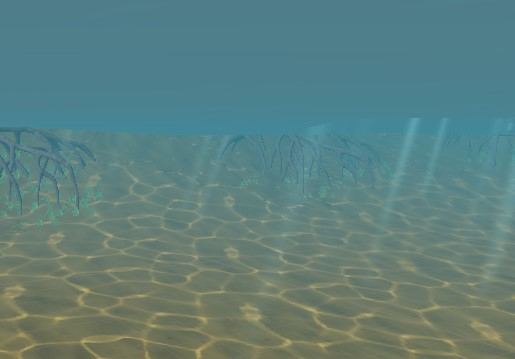

# Documentation
This folder contains the project's main documentation.

These files will explain the different systems in our project, how to use them, and how they work internally.

If you are interested, [here is the styleguide that this documentation follows](./styleguide.md). 
The documentation is a work-in-progress and is subject to change as our systems change 
and we polish our formatting. If there is any confusion, or any broken links,
please reach out to us or create a GitHub issue, and we will help as soon as possible.
You can reach me at alexanderwills37@gmail.com.

## [Player](./Player.md)
- Movement
- Health/Breath bars
- Rotating HUD
- Hierarchy structure (including OVRCameraRig)

## [Water Effects](./Water.md)

- Depth fog
- Wavy surface
- Caustic lighting on the seafloor
- Rays of light

## [Seagrass](./Grass.md)
## [Manatee AI](./ManateeAI.md)
## [Slide Deck](./SlideDeck.md)